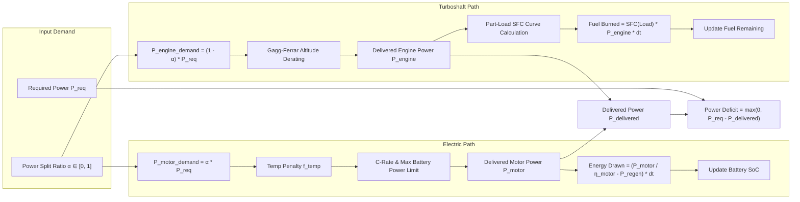
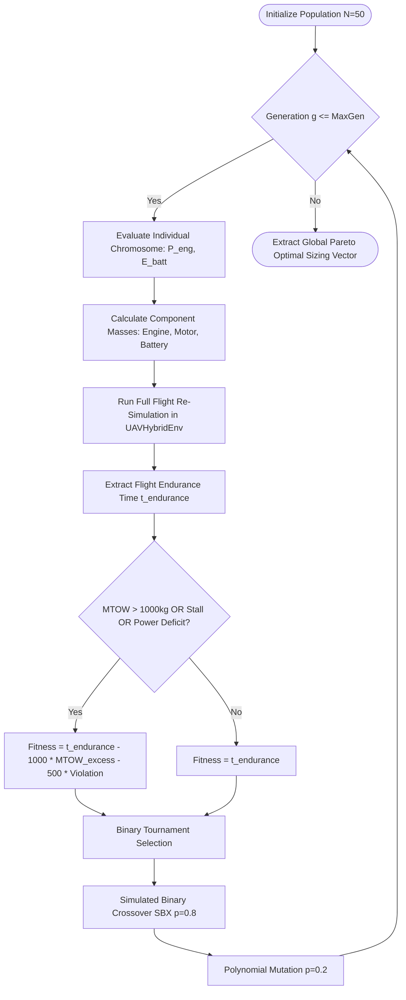
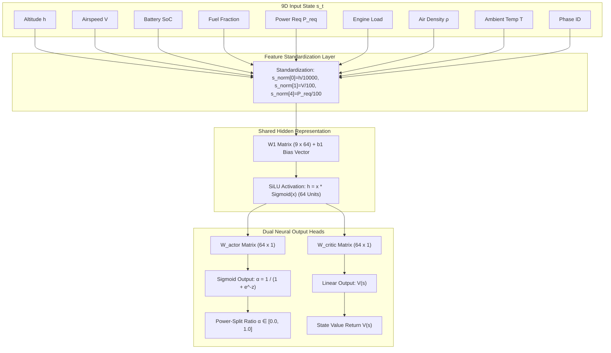

# Concepts and Formulae Explanation: What, Why, and How

This document contains a comprehensive mathematical and theoretical catalog of all formulas, physics models, energy dynamics, optimization routines, and Reinforcement Learning mechanisms implemented in the AeroOptima UAV platform.

Each section explains **WHAT** the concept/formula is, **WHY** it is derived/used, and **HOW** it is evaluated mathematically and computationally.

---

## 📐 Section 1: Aerodynamics & Atmospheric Calculation Flow

```mermaid
flowchart TD
    A[Inputs: Altitude h, Speed V, Climb Rate h_dot, Mass m] --> B[ISA Atmosphere Engine]
    B --> C[Compute Temperature T = T0 - L*h]
    B --> D[Compute Air Density ρ = ρ0 * 1 - L*h/T0 ^ 4.25588]
    
    C & D --> E[Stall Speed Check]
    E --> F["V_stall = sqrt(2 * m * g / (ρ * S * CL_max))"]
    
    F --> G[Flight Angle γ = asin(h_dot / V)]
    G --> H["Lift Coefficient CL = 2 m g cos(γ) / (ρ V² S)"]
    
    H --> I[Drag Coefficient Breakdown]
    I --> J["CD0 = 0.022 (Parasite)"]
    I --> K["CDi = CL² / (π * AR * e) (Induced)"]
    I --> L["CD_beta = 0.5 * β² (Sideslip)"]
    I --> M["CD_mach = CD0 * (1/sqrt(1-M²) - 1) (Compressibility)"]
    
    J & K & L & M --> N["Total CD = CD0 + CDi + CD_beta + CD_mach"]
    N --> O["Total Drag Force D = 1/2 * ρ * V² * S * CD"]
    
    O --> P[Propeller Advance Ratio Efficiency η_prop]
    P --> Q["Power Required P_req = (D * V + m * g * h_dot) / (1000 * η_prop) [kW]"]
```

---

## 🌐 Section 1 (Detail): International Standard Atmosphere (ISA 1976) & Weather Physics

### 1. Temperature vs Altitude Formula
#### WHAT is it?
Calculates ambient air temperature $T(h)$ as a function of geometric altitude $h$ up to the troposphere boundary ($11,000\text{ m}$).
#### WHY is it used?
Air density, speed of sound, battery thermal limits, and aerodynamic drag all depend directly on atmospheric temperature.
#### HOW is it calculated?
$$T(h) = T_{\text{sea\_level}} - L \cdot h$$
Where:
- $T_{\text{sea\_level}} = 288.15\text{ K}$ ($15^\circ\text{C}$ standard sea-level temperature)
- $L = 0.0065\text{ K/m}$ (Standard tropospheric lapse rate)
- Code location: [`atmosphere.py`](file:///d:/project/HAL/backend/physics/atmosphere.py#L12)

---

### 2. Barometric Air Density Formula
#### WHAT is it?
Determines atmospheric density $\rho(h)$ at altitude $h$.
#### WHY is it used?
Lift force $L = \frac{1}{2}\rho V^2 S C_L$, drag force, stall speed, and turboshaft oxygen derating require precise density evaluation.
#### HOW is it calculated?
$$\rho(h) = \rho_0 \left(1 - \frac{L \cdot h}{T_0}\right)^{\left(\frac{g_0 \cdot M}{R \cdot L} - 1\right)}$$
Where:
- $\rho_0 = 1.225\text{ kg/m}^3$ (Sea-level air density)
- $g_0 = 9.80665\text{ m/s}^2$, $M = 0.0289644\text{ kg/mol}$, $R = 8.31447\text{ J/(mol}\cdot\text{K)}$
- Simplifies exponent to $\approx 4.25588$.
- Code location: [`atmosphere.py`](file:///d:/project/HAL/backend/physics/atmosphere.py#L22)

---

## ⚡ Section 2: Hybrid Propulsion & Battery Thermal Flow



---

## 🛩️ Section 2 (Detail): Aerodynamics & Flight Physics

### 3. Wing Aspect Ratio ($AR$)
#### WHAT is it?
Geometric ratio of squared wingspan to wing planform area.
#### WHY is it used?
High aspect ratio wings reduce induced drag coefficient $C_{Di}$, enabling long loiter endurance for tactical UAVs.
#### HOW is it calculated?
$$AR = \frac{b^2}{S}$$
Where $b = 18.5\text{ m}$ (wingspan) and $S = 22.0\text{ m}^2$ (wing area). $AR \approx 15.56$.
- Code location: [`aerodynamics.py`](file:///d:/project/HAL/backend/physics/aerodynamics.py#L10)

---

### 4. Aerodynamic Stall Speed ($V_{\text{stall}}$)
#### WHAT is it?
Minimum steady airspeed required to generate lift equal to total aircraft weight before stall boundary $C_{L,\max} = 1.5$.
#### WHY is it used?
Prevents loss of control. Ensures takeoff, climb, cruise, and landing operational speeds remain strictly above stall thresholds.
#### HOW is it calculated?
$$V_{\text{stall}} = \sqrt{\frac{2 \cdot m \cdot g}{\rho \cdot S \cdot C_{L,\max}}}$$
- Code location: [`aerodynamics.py`](file:///d:/project/HAL/backend/physics/aerodynamics.py#L17)

---

### 5. Aerodynamic Drag Coefficient Breakdown ($C_D$)
#### WHAT is it?
Total drag coefficient combining zero-lift parasite drag ($C_{D0}$), induced drag ($C_{Di}$), sideslip drag ($C_{D\beta}$), and compressibility drag ($C_{D,\text{mach}}$).
#### WHY is it used?
Accurately quantifies resistance forces resisting forward flight under varying flight angles and speeds.
#### HOW is it calculated?
$$C_D = C_{D0} + C_{Di} + C_{D\beta} + C_{D,\text{mach}}$$
$$C_{Di} = \frac{C_L^2}{\pi \cdot AR \cdot e}$$
$$C_{D\beta} = 0.5 \cdot \beta^2$$
$$C_{D,\text{mach}} = C_{D0} \cdot \left(\frac{1}{\sqrt{1 - M^2}} - 1\right) \quad (\text{for } 0.4 < M < 0.95)$$
Where:
- $C_{D0} = 0.022$ (Parasite drag coefficient)
- $e = 0.85$ (Oswald efficiency factor)
- $\beta = \text{sideslip angle in radians}$
- Code location: [`aerodynamics.py`](file:///d:/project/HAL/backend/physics/aerodynamics.py#L90-L105)

---

### 6. Power Required Formula ($P_{\text{req}}$)
#### WHAT is it?
Total mechanical power required at the propeller shaft to sustain flight speed $V$ and rate of climb $\dot{h}$.
#### WHY is it used?
Establishes the fundamental energy demand that must be satisfied by the hybrid power source ($P_{\text{motor}} + P_{\text{engine}}$).
#### HOW is it calculated?
$$P_{\text{aero}} = \frac{D \cdot V}{1000 \cdot \eta_{\text{prop}}} \quad (\text{kW})$$
$$P_{\text{climb}} = \frac{m \cdot g \cdot \dot{h}}{1000 \cdot \eta_{\text{prop}}} \quad (\text{kW})$$
$$P_{\text{req}} = P_{\text{aero}} + P_{\text{climb}}$$
Where $\eta_{\text{prop}}$ is the advance ratio propeller efficiency ($0.65 - 0.86$).
- Code location: [`propulsion.py`](file:///d:/project/HAL/backend/physics/propulsion.py#L40)

---

## 🧬 Section 3: Genetic Algorithm Optimization Architecture



---

## 🤖 Section 4: Neural PPO Actor-Critic Architecture


