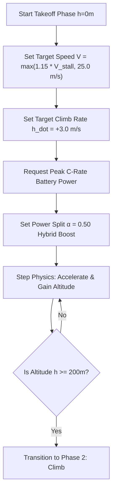
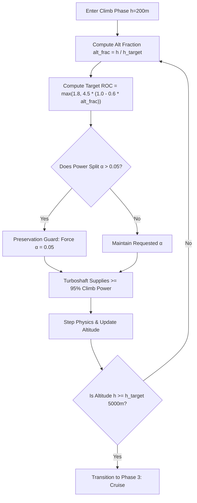
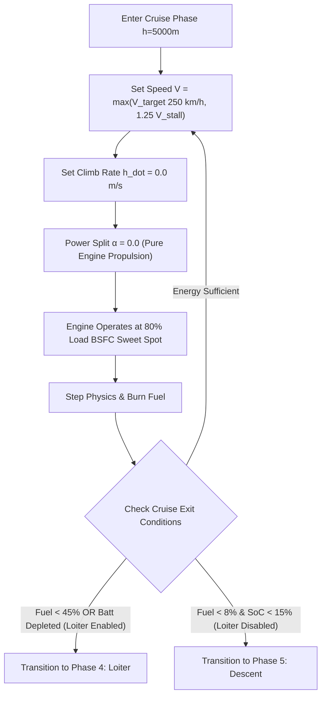
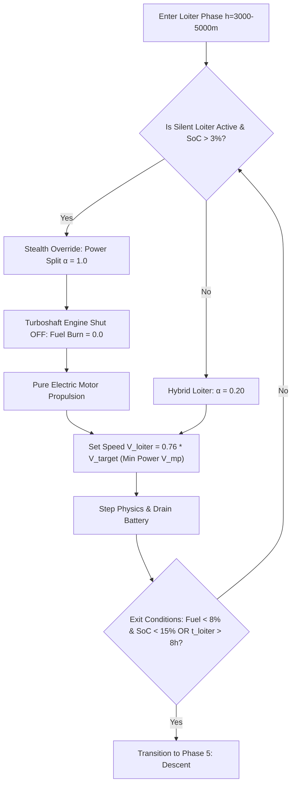
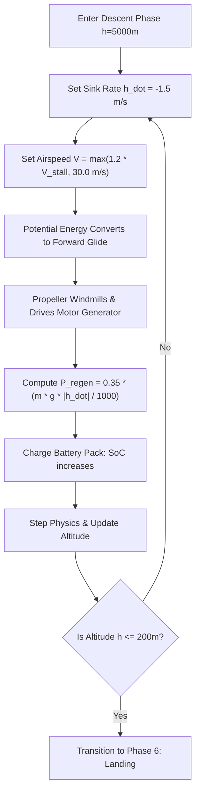
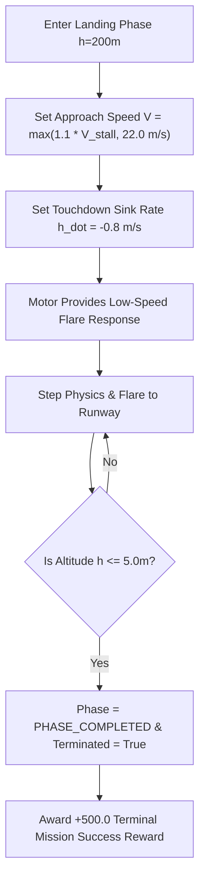

# Detailed Phase Specifications: What, Why, and How

This document provides a deep-dive operational specification for every phase in the AeroOptima flight profile. It bridges high-level aerospace requirements with exact code-level mechanics in [`backend/env/uav_env.py`](file:///d:/project/HAL/backend/env/uav_env.py).

---

## 🛠️ Master Phase Parameter Matrix

| Parameter / Metric | Phase 1: Takeoff | Phase 2: Climb | Phase 3: Cruise | Phase 4: Loiter | Phase 5: Descent | Phase 6: Landing |
| :--- | :--- | :--- | :--- | :--- | :--- | :--- |
| **Altitude Envelope** | $0 \to 200\text{ m}$ | $200 \to 5000\text{ m}$ | $5000\text{ m}$ | $3000-5000\text{ m}$ | $5000 \to 200\text{ m}$ | $200 \to 0\text{ m}$ |
| **Airspeed ($V$)** | $\max(1.15 V_{\text{stall}}, 25\text{ m/s})$ | $\max(1.30 V_{\text{stall}}, 35\text{ m/s})$ | $\max(V_{\text{target}}, 1.25 V_{\text{stall}})$ | $\max(0.76 V_{\text{target}}, 1.2 V_{\text{stall}})$ | $\max(1.20 V_{\text{stall}}, 30\text{ m/s})$ | $\max(1.10 V_{\text{stall}}, 22\text{ m/s})$ |
| **Climb Rate ($\dot{h}$)** | $+3.0\text{ m/s}$ | $+4.5 \to +1.8\text{ m/s}$ | $0.0\text{ m/s}$ | $0.0\text{ m/s}$ | $-1.5\text{ m/s}$ | $-0.8\text{ m/s}$ |
| **Power Split ($\alpha$)** | $\alpha = 0.50$ (Hybrid) | $\alpha \le 0.05$ (Engine) | $\alpha = 0.00$ (Engine) | $\alpha = 1.00$ (Stealth Motor) | $\alpha = 0.00$ (Glide) | $\alpha = 0.30$ (Flare) |
| **C-Rate Mode** | Peak ($C_{\text{peak}} = 5.0$) | Cont ($C_{\text{cont}} = 2.0$) | Cont ($C_{\text{cont}} = 2.0$) | Cont ($C_{\text{cont}} = 2.0$) | Regeneration | Peak / Cont |
| **Propeller Efficiency ($\eta_{\text{prop}}$)** | $0.65$ | $0.78$ | $0.85$ | $0.82$ | $0.70$ | $0.65$ |
| **ICE Status** | Active | Active | Active (Sweet spot) | OFF (Stealth) | Idle / OFF | Idle |

---

## 1. Detailed Breakdown: Phase 1 — Takeoff



### WHAT happens during Takeoff?
The aircraft rolls along the runway, accelerates to rotation speed, lifts off, and climbs past obstacles to an altitude of $200\text{ m}$.

### WHY are these specific values used?
- **$1.15 \times V_{\text{stall}}$ Speed Floor**: Guarantees stall margin during rotation.
- **$\alpha = 0.50$ Power Split**: Takes advantage of instant torque from the electric motor to reduce takeoff roll distance to $< 350\text{ m}$.
- **Peak C-Rate Authorization**: Allows short-burst power draws from the Li-Ion battery pack without thermal damage.

### HOW is it executed in code?
1. [`uav_env.py`](file:///d:/project/HAL/backend/env/uav_env.py#L255): Airspeed is computed as $V = \max(1.15 V_{\text{stall}}, 25.0\text{ m/s})$.
2. Target climb rate is set to $\dot{h} = +3.0\text{ m/s}$.
3. Power required is calculated via aerodynamic equations:
   $$P_{\text{req}} = \frac{\frac{1}{2}\rho V^2 S C_D \cdot V + m g \dot{h}}{1000 \cdot \eta_{\text{prop}}}$$
4. Transition condition evaluated at end of step:
   ```python
   if self.current_phase == self.PHASE_TAKEOFF and self.altitude >= 200.0:
       self.current_phase = self.PHASE_CLIMB
   ```

---

## 2. Detailed Breakdown: Phase 2 — Climb



### WHAT happens during Climb?
The UAV ascends from $200\text{ m}$ to mission cruise altitude ($5000\text{ m}$). Air density decreases by over 40%, increasing true airspeed for a given dynamic pressure.

### WHY are these specific values used?
- **Dynamic Rate of Climb**: Altitude lapse causes engine power derating. Decreasing target ROC from $4.5\text{ m/s}$ at sea level to $1.8\text{ m/s}$ at $5000\text{ m}$ prevents engine overload.
- **Battery Preservation Guard**: Draining battery power in climb is aerodynamically wasteful because fuel is much lighter per kWh ($11,900\text{ Wh/kg}$ vs battery $250\text{ Wh/kg}$). Motor power split is strictly capped to $\alpha \le 0.05$.

### HOW is it executed in code?
1. [`uav_env.py`](file:///d:/project/HAL/backend/env/uav_env.py#L261): Altitude fraction is computed:
   $$\text{alt\_frac} = \frac{h}{h_{\text{target}}}$$
   $$\dot{h} = \max(1.8, 4.5 \times (1.0 - 0.6 \times \text{alt\_frac}))$$
2. **Preservation Guard**:
   ```python
   if self.current_phase == self.PHASE_CLIMB and psr > 0.05:
       psr = 0.05  # Force max 5% electric motor contribution
   ```
3. Transition condition:
   ```python
   elif self.current_phase == self.PHASE_CLIMB and self.altitude >= self.target_altitude:
       self.current_phase = self.PHASE_CRUISE
   ```

---

## 3. Detailed Breakdown: Phase 3 — Cruise



### WHAT happens during Cruise?
The UAV maintains steady level flight at $h = 5000\text{ m}$ and target speed $V = 250\text{ km/h}$ ($69.44\text{ m/s}$).

### WHY are these specific values used?
- **BSFC Optimization**: Operating the turboshaft engine near $80\%$ load yields an SFC of $\sim 0.38\text{ kg/kWh}$, maximizing nautical miles flown per kg of fuel.
- **Zero Motor Draw ($\alpha = 0.0$)**: Battery energy is preserved exclusively for loiter and emergency RTB.

### HOW is it executed in code?
1. Level flight dynamics: $\dot{h} = 0.0\text{ m/s}$. Airspeed $V = \max(V_{\text{target}}, 1.25 V_{\text{stall}})$.
2. Heuristic policy returns $\alpha = 0.0$, running the engine in its optimal BSFC regime.
3. Transition condition:
   ```python
   if fuel_ratio < 0.45 or battery_depleted_in_cruise or cruise_time > 64800:
       self.current_phase = self.PHASE_LOITER
   ```

---

## 4. Detailed Breakdown: Phase 4 — Loiter / Silent Loiter



### WHAT happens during Loiter?
The UAV flies in an energy-conserving loiter pattern over the target area. In **Silent Loiter Mode**, the turboshaft engine is powered off, and the aircraft flies silently on electric motor power.

### WHY are these specific values used?
- **Minimum Power Airspeed**: Target velocity is reduced to $V_{\text{loiter}} = 0.76 V_{\text{target}} \approx 190\text{ km/h}$, operating near maximum aerodynamic endurance ratio $C_L^{3/2} / C_D$.
- **Stealth & Survival**: Turning off the engine eliminates thermal (IR) and acoustic signatures.
- **3% SoC Floor**: Allows the operator to utilize almost all battery energy during stealth operations down to a safety floor of $3\%$.

### HOW is it executed in code?
1. [`uav_env.py`](file:///d:/project/HAL/backend/env/uav_env.py#L237):
   ```python
   if (self.current_phase == self.PHASE_LOITER and self.silent_loiter_mode and self.soc > 0.03):
       psr = 1.0  # 100% electric motor, ICE OFF
   ```
2. Engine fuel consumption drops to $0.0\text{ kg/h}$. Battery SoC decays monotonically:
   $$\text{SoC}_{t+\Delta t} = \text{SoC}_t - \frac{P_{\text{motor}} \cdot \Delta t}{3600 \cdot E_{\text{batt eff}} \cdot \eta_{\text{motor}}}$$
3. Transition condition:
   ```python
   if (fuel_ratio < 0.08 and self.soc < 0.15) or loiter_time > 28800:
       self.current_phase = self.PHASE_DESCENT
   ```

---

## 5. Detailed Breakdown: Phase 5 — Descent



### WHAT happens during Descent?
The UAV descends from $5000\text{ m}$ to $200\text{ m}$ at a steady sink rate of $\dot{h} = -1.5\text{ m/s}$.

### WHY are these specific values used?
- **Zero Fuel Glideslope**: Potential energy drives forward flight; fuel flow is zero.
- **Kinetic Energy Recovery**: The propeller windmills, driving the motor as an alternator to charge the battery ($P_{\text{regen}}$).

### HOW is it executed in code?
1. Airspeed $V = \max(1.2 V_{\text{stall}}, 30.0\text{ m/s})$, climb rate $\dot{h} = -1.5\text{ m/s}$.
2. Power regen is computed in [`propulsion.py`](file:///d:/project/HAL/backend/physics/propulsion.py#L55):
   $$P_{\text{regen}} = 0.35 \times \frac{m g |\dot{h}|}{1000}$$
   $$\text{SoC}_{t+\Delta t} = \min\left(1.0, \text{SoC}_t + \frac{P_{\text{regen}} \cdot \Delta t}{3600 \cdot E_{\text{batt eff}}}\right)$$
3. Transition condition:
   ```python
   elif self.current_phase == self.PHASE_DESCENT and self.altitude <= 200.0:
       self.current_phase = self.PHASE_LANDING
   ```

---

## 6. Detailed Breakdown: Phase 6 — Landing



### WHAT happens during Landing?
Final approach and touchdown onto the runway ($200\text{ m} \to 0\text{ m}$).

### WHY are these specific values used?
- **$1.10 \times V_{\text{stall}}$ Touchdown Speed**: Ensures soft ground contact without stall drop.
- **STANAG 4671 Compliance Check**: Verifies 30-minute reserve fuel/energy upon touchdown.

### HOW is it executed in code?
1. Sink rate $\dot{h} = -0.8\text{ m/s}$, airspeed $V = \max(1.1 V_{\text{stall}}, 22.0\text{ m/s})$.
2. When altitude drops below $5.0\text{ m}$:
   ```python
   elif self.current_phase == self.PHASE_LANDING and self.altitude <= 5.0:
       self.current_phase = self.PHASE_COMPLETED
       terminated = True
   ```
3. Final reward of $+500.0$ added to episode total.
